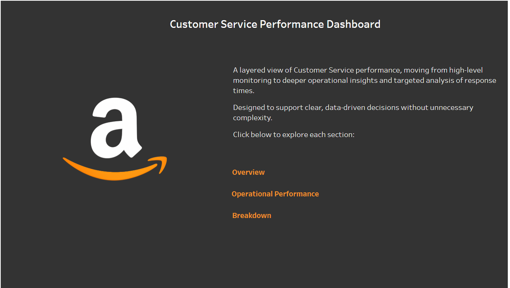
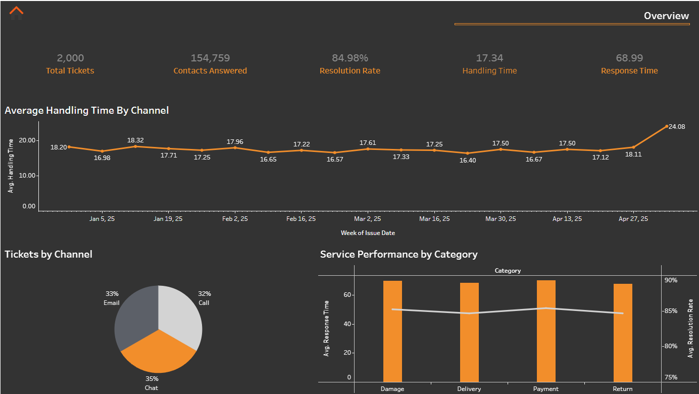
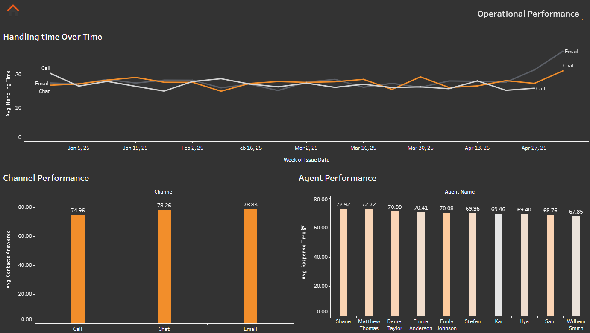
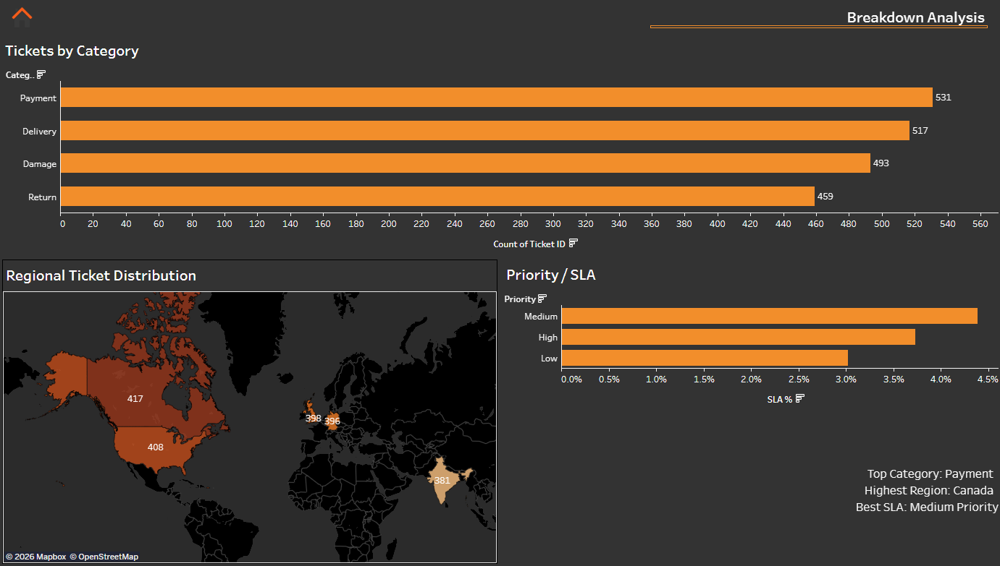

# 📞 Amazon Customer Service Performance Dashboard

## 📌 Project Overview

Developed an interactive Tableau dashboard to analyze customer service operations and monitor key performance indicators across multiple dimensions. The dashboard enables stakeholders to evaluate service efficiency, identify operational bottlenecks, and improve customer support performance.

## 🎯 Business Objective

To provide a centralized view of customer service performance and support data-driven decision-making by tracking ticket resolution efficiency, response effectiveness, and operational productivity.

## 🛠️ Tools Used

- Tableau
- Excel
- Data Cleaning
- Dashboard Design
- KPI Analysis

## 📊 Dashboard Features

## 🏠 Overview

Provides a high-level summary of customer service performance metrics and operational health.

## ⚙️ Operational Performance

Analyzes service efficiency through response times, handling times, and ticket resolution metrics.

## 🔍 Breakdown Analysis

Enables deeper exploration of customer service performance across different categories and operational dimensions.

## 📈 Key Performance Indicators (KPIs)
- Total Tickets
- Contacts Answered
- Resolution Rate
- Average Handling Time
- Average Response Time

## 💡 Key Insights Enabled
- Monitor overall service performance trends
- Identify opportunities to improve resolution efficiency
- Track response and handling times
- Evaluate customer support effectiveness
- Support operational decision-making through KPI monitoring
  
## 📂 Dataset

Dataset sourced from Kaggle and further modified, cleaned, and transformed to support business analysis and dashboard requirements.

## 🖼️ Dashboard Preview
### 🏠 Home

### 📊 Overview

### ⚙️ Operational Performance

### 🔍 Breakdown Analysis

## 🔗 Live Dashboard

https://public.tableau.com/views/AmazonCustomerServicePerformanceDashboard/Home

## 🚀 Business Impact

This dashboard enables stakeholders to monitor service efficiency, evaluate customer support effectiveness, and identify operational improvement opportunities through KPI-driven analysis.
