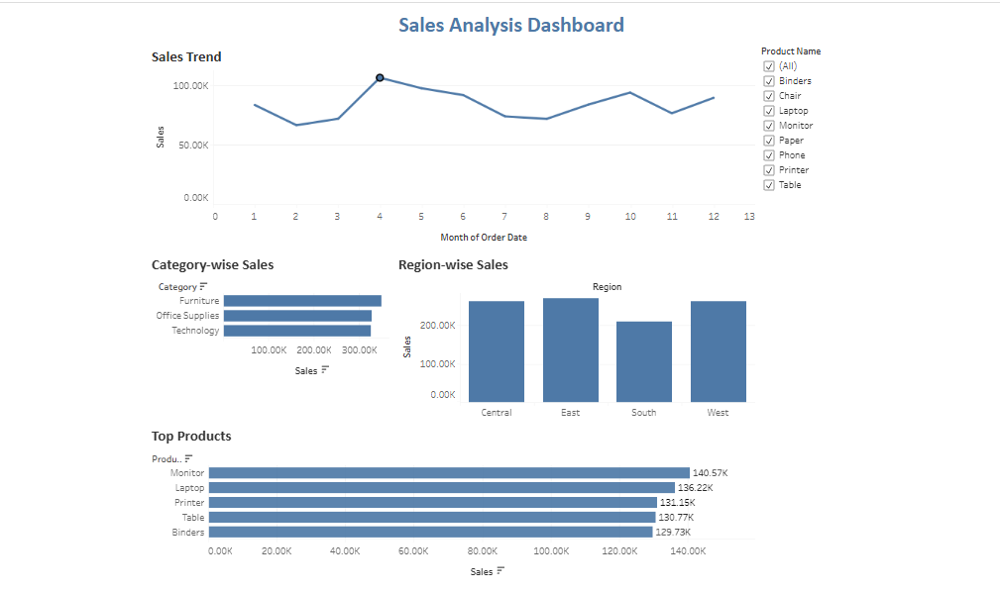

# 📈 Sales Analysis Dashboard

## 📌 Project Overview

Developed an interactive Tableau dashboard to analyze sales performance across multiple business dimensions, including sales trends, product categories, regions, and product-level performance. The dashboard enables stakeholders to monitor revenue patterns, identify top-performing products, and support data-driven sales strategies.

## 🎯 Business Objective

To provide business stakeholders with actionable insights into sales performance by identifying revenue trends, high-performing regions, profitable product categories, and top-selling products.

## 🛠️ Tools Used

* Tableau
* Excel
* Data Cleaning
* Data Visualization
* Business Analytics

## 📊 Dashboard Features

### 📈 Sales Trend Analysis

Tracks monthly sales performance to identify growth patterns, seasonality, and fluctuations in revenue.

### 🏷️ Category-wise Sales

Compares sales performance across major product categories to understand category contribution.

### 🌎 Region-wise Sales

Analyzes sales distribution across geographic regions to identify high-performing and underperforming markets.

### ⭐ Top Products Analysis

Highlights the highest revenue-generating products to support inventory and sales planning decisions.

### 🎛️ Interactive Product Filter

Allows users to dynamically explore sales performance by product selection.

## 📈 Key Performance Indicators (KPIs)

* Monthly Sales Performance
* Category-wise Sales
* Region-wise Sales
* Top Product Sales
* Product Contribution Analysis

## 💡 Key Insights Enabled

* Identify sales trends and seasonal patterns
* Compare performance across product categories
* Evaluate regional sales contribution
* Discover top-selling products
* Support strategic sales and inventory decisions

## 📂 Dataset

Dataset sourced from Kaggle and further cleaned, modified, and transformed to support business analysis and visualization requirements.

## 🖼️ Dashboard Preview

## 🚀 Business Impact

This dashboard helps business stakeholders monitor revenue performance, identify growth opportunities, evaluate regional effectiveness, and optimize product-level sales strategies through data-driven decision-making.

## 🔗 Live Dashboard

https://public.tableau.com/views/SalesAnalysisDashboard_17754041282650/SalesAnalysisDashboard
