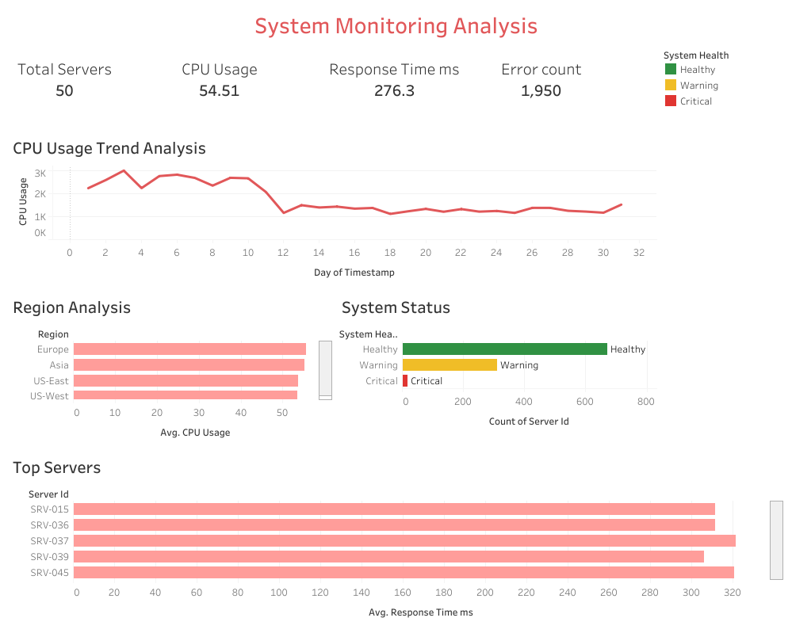

# ⚙️ System Monitoring Analysis Dashboard

## 📌 Project Overview

Developed an interactive Tableau dashboard to monitor system performance, analyze infrastructure health, and identify operational bottlenecks across multiple servers and regions. The dashboard provides stakeholders with a centralized view of resource utilization, response performance, and system reliability metrics.

## 🎯 Business Objective

To enable proactive monitoring of system performance by tracking resource utilization, response times, error rates, and overall system health. The dashboard supports operational decision-making by helping identify performance issues before they impact service quality.

## 🛠️ Tools Used

* Tableau
* Excel
* Data Analysis
* Dashboard Design
* KPI Monitoring

## 📊 Dashboard Features

### 🖥️ Infrastructure Overview

Provides a high-level summary of server availability, CPU utilization, response times, and error counts.

### 📈 CPU Usage Trend Analysis

Monitors CPU utilization patterns over time to identify performance fluctuations and potential capacity issues.

### 🌍 Regional Analysis

Compares average CPU utilization across different regions to identify geographic performance variations.

### 🚦 System Health Monitoring

Classifies servers into Healthy, Warning, and Critical categories to support proactive issue management.

### 🏆 Top Servers Analysis

Highlights servers with the highest response times to help identify performance bottlenecks and optimization opportunities.

## 📈 Key Performance Indicators (KPIs)

* Total Servers
* Average CPU Usage
* Average Response Time
* Error Count
* System Health Status
* Regional Performance Metrics

## 💡 Key Insights Enabled

* Monitor infrastructure performance trends
* Identify servers with elevated response times
* Track CPU utilization across regions
* Detect operational risks through health status monitoring
* Support capacity planning and performance optimization

## 📂 Dataset

Custom dataset created and structured for system performance monitoring and operational analysis.

## 🖼️ Dashboard Preview

## 🚀 Business Impact

This dashboard helps operations teams and decision-makers monitor system reliability, identify performance bottlenecks, improve operational efficiency, and support proactive infrastructure management through data-driven insights.

## 🔗 Live Dashboard

https://public.tableau.com/app/profile/pavithra.panneerselvam/viz/SystemMonitoringAnalysis/Dashboard1

https://public.tableau.com/views/SystemMonitoringAnalysis/Dashboard1

